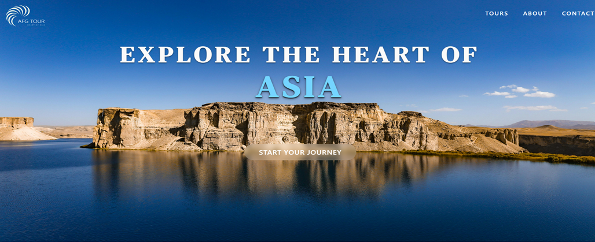
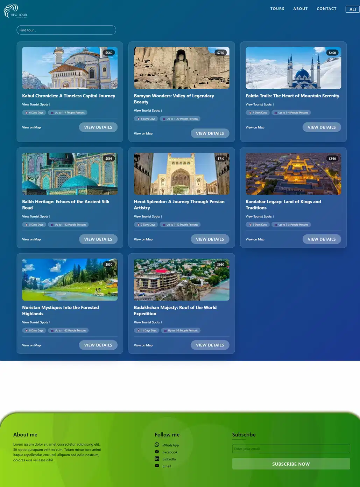
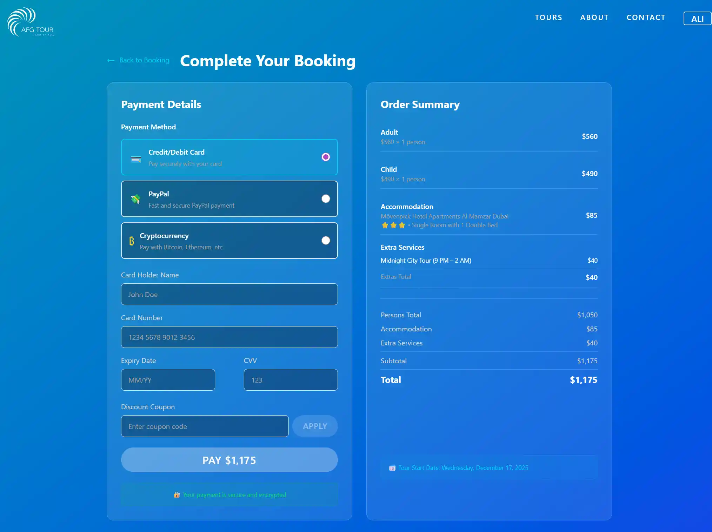

# 🇦🇫 Explore the Heart of Asia — Afghanistan Tour Booking Web App

---

## 🏞️ **Project Overview**

**Explore the Heart of Asia** is a fully responsive tour booking web application built using **React**, **Redux Toolkit**, **Tailwind CSS**, and **Vite**.  
It showcases Afghanistan’s beauty with a modern, interactive user interface and includes a complete booking workflow — from selecting a tour package to viewing a full price summary.

This project highlights your expertise in building **real-world front-end applications**, including state management, routing, data fetching, UI/UX, and responsive design.

---

## ✨ **Key Features**

### 🔍 **Search & Filter**

- Search tours by name or keyword
- Price range filtering
- Dynamic and responsive results

### 🏕️ **Tour Listing & Details**

- API-based tour data
- High-quality image gallery
- Detailed itinerary, locations, prices, hotel info, and tour type

### 🧾 **Multi-Step Booking Process**

1. Select date
2. Choose number of people
3. Select accommodation
4. Add extra services
5. Review order summary
6. Confirm booking

### 💸 **Smart Price Calculation**

- Auto-updates price based on selections
- Multi-currency support (USD / EUR / AED)
- Coupon system with validation
- Redux-powered global state

### ⚙️ **Technical Features**

- React Router (HashRouter, loaders, errors, nested routes)
- Redux Toolkit slices (cart, user, currency)
- Tailwind CSS styling
- Custom hooks + optimized rendering with `useMemo`
- Error boundary + loading states
- Fully mobile responsive

---

## 📸 **Screenshots**

### **Homepage**

### **Tour Details Page**

### **Booking Steps**

